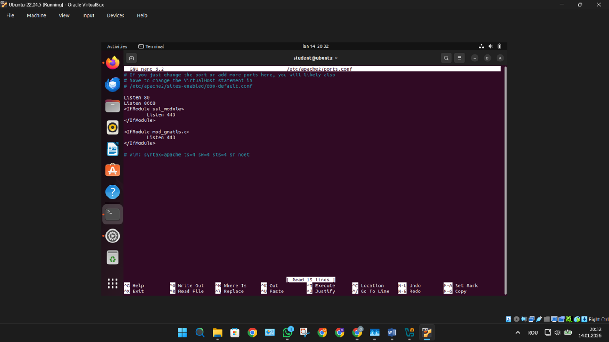

# SOHO Network Security with Apache and XRDP

## Overview
This project presents the configuration and security of a SOHO LAN connected to the Internet through a virtual router. The implementation was performed on Ubuntu 22.04 in VirtualBox.

## Objectives
- configure a virtual SOHO network
- verify IP addressing and routing
- install and configure Apache
- run the web server on port 8008
- secure web resources
- configure Remote Desktop access with XRDP
- test and validate the implemented services

## Technologies Used
- Ubuntu 22.04 LTS
- Oracle VirtualBox
- Apache2
- XRDP
- Windows client

## Network Architecture
- NAT adapter for Internet access
- virtual LAN environment for testing
- Apache running on port 8008
- XRDP running on port 3389

## Security Features
- Basic authentication for protected web content
- IP-based access restriction
- separation between public and restricted directories

## Repository Structure
- `docs/` – project report
- `screenshots/` – service validation screenshots
- `configs/` – Apache and access control configuration
- `scripts/` – installation script

## Screenshots

### Apache running

### Apache port 8008

### Basic authentication

### Access denied (403)

### XRDP remote connection

## Author
Student: Marius Zaharia Andronic
Facultatea: Fiesc Calculatoare – dual
