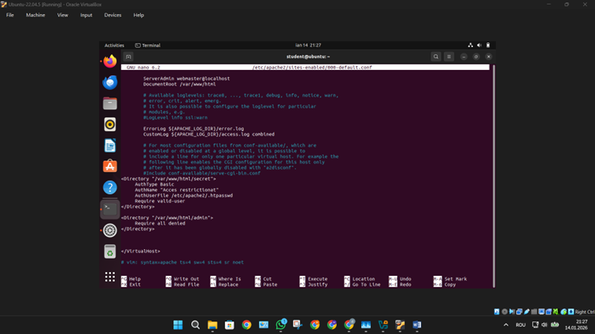
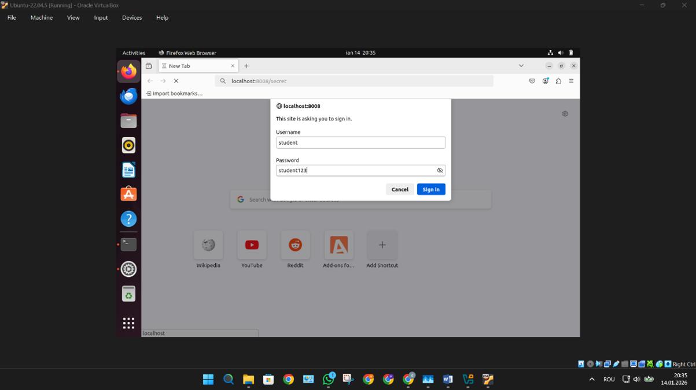
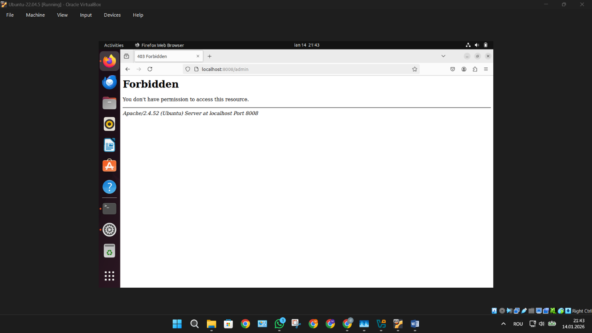
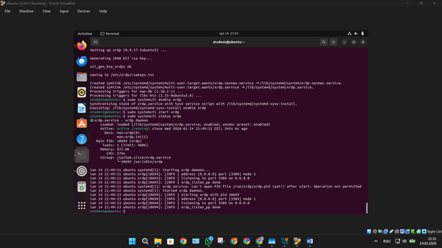
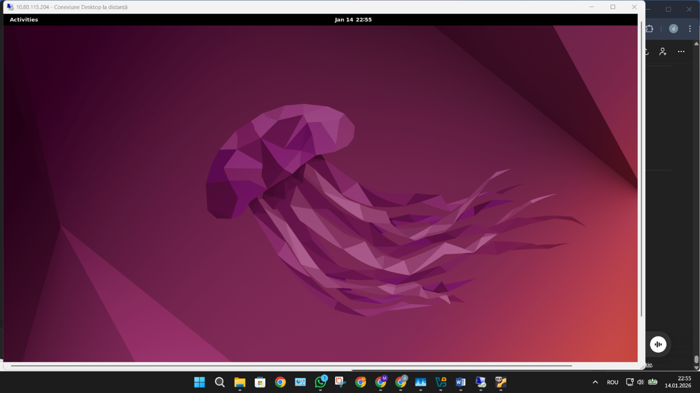

# 🔐 Apache Secured Server with XRDP Remote Access

> Linux server configuration project: Apache security + remote desktop access (XRDP)

---

## 📌 Overview

This project demonstrates the configuration of a secure Apache web server and remote desktop access using XRDP on Ubuntu.

It includes:
- Apache web server setup
- Basic authentication using `.htpasswd`
- Access restriction (403 Forbidden)
- Custom port configuration
- Remote desktop access via XRDP

---

## 🎯 Why This Project

This project was built to demonstrate practical system administration skills in a real Linux environment.

It focuses on:
- configuring and securing web services
- managing remote access
- understanding networking behavior in a virtual machine setup

---

## 🧠 Skills Demonstrated

- Linux system administration
- Apache configuration and security
- Authentication using `.htpasswd`
- VirtualHost configuration
- Port management
- XRDP remote desktop setup
- Basic networking (IP, routing)

---

## ⚙️ Technologies Used

- Ubuntu 22.04
- Apache2
- XRDP
- VirtualBox
- Linux CLI tools

---

## 🔧 Apache Configuration

### ➤ Custom Port (8008)

Apache was configured to run on a custom port:

---

### ➤ VirtualHost Setup

Custom VirtualHost configuration:

---

### ➤ Apache Running

Apache service successfully started:

---

## 🔐 Security Implementation

### ➤ Password Authentication (.htpasswd)

User authentication configured:

---

### ➤ Login Prompt

Browser authentication required:

---

### ➤ Restricted Access (403 Forbidden)

Access to protected directory blocked:

---

## 🌐 Networking

- Localhost access via custom port
- Routing and IP configuration inside VM

---

## 🖥️ XRDP Remote Desktop

### ➤ XRDP Service Running

XRDP service active:

---

### ➤ Remote Desktop Connection

Successful connection from Windows:

---

## 📊 How It Works

1. Apache serves content on port 8008  
2. Certain directories are protected using `.htpasswd`  
3. Unauthorized users receive **403 Forbidden**  
4. XRDP allows remote graphical access to the system  
5. All services run inside a virtualized Ubuntu environment  

---

## 📝 Notes

- XRDP uses the RDP protocol to provide GUI access to Linux systems :contentReference[oaicite:0]{index=0}  
- Apache authentication is based on user/password validation via `.htpasswd`  
- The project simulates a real-world secured server environment  

---

## 👤 Author

**Marius Zaharia Andronic**  
Computer Engineering Student (Dual Program)

---
